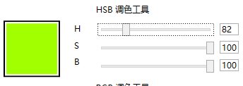
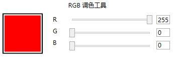

<div align="center">
   
</div>


<p align="center">Gensokyo是一个XAML控件库，用于为开发者提高界面编写效率。</p>
<p align="center">这个项目的名字源自出现在作品<a href="https://zh.moegirl.org.cn/%E4%B8%9C%E6%96%B9Project">《东方Project》</a>的世界观<a href="https://zh.moegirl.org.cn/%E5%B9%BB%E6%83%B3%E4%B9%A1">幻想乡</a></p>

# Gensokyo

> <p align="center">河童重工，天下第一</p>

[Engilsh](README.en.md)

# 🔨开始使用

使用本项目时，只需要将需要使用的项目对应的XAML文件引入App.xaml中即可。下面提供了每个项目对应的字典路径。

## Gensokyo.Components

```XAML
<ResourceDictionary>
    <ResourceDictionary.MergedDictionaries>
        <ResourceDictionary Source="pack://application:,,,/Gensokyo.Components;component/Themes/Generic.xaml"/>
    </ResourceDictionary.MergedDictionaries>
</ResourceDictionary>
```

## Gensokyo.Layouts

```XAML
<ResourceDictionary>
    <ResourceDictionary.MergedDictionaries>
        <ResourceDictionary Source="pack://application:,,,/Gensokyo.Layouts;component/Themes/Generic.xaml"/>
    </ResourceDictionary.MergedDictionaries>
</ResourceDictionary>
```

## Gensokyo.Xaml

```XAML
<ResourceDictionary>
    <ResourceDictionary.MergedDictionaries>
        <ResourceDictionary Source="pack://application:,,,/Gensokyo.Xaml;component/Themes/Generic.xaml"/>
    </ResourceDictionary.MergedDictionaries>
</ResourceDictionary>
```
## 引用全部项目

```XAML
<ResourceDictionary>
    <ResourceDictionary.MergedDictionaries>        
        <ResourceDictionary Source="pack://application:,,,/Gensokyo.Components;component/Themes/Generic.xaml"/>
        <ResourceDictionary Source="pack://application:,,,/Gensokyo.Layouts;component/Themes/Generic.xaml"/>
        <ResourceDictionary Source="pack://application:,,,/Gensokyo.Xaml;component/Themes/Generic.xaml"/>
    </ResourceDictionary.MergedDictionaries>
</ResourceDictionary>
```

# 项目解决的问题

1. 布局的复用问题（目标项目: Gensokyo.Layouts）
2. 组件的复用问题（目标项目: Gensokyo.Components）
3. Xaml增强（目标项目: Gensokyo.Xaml）

# Gensokyo.Layouts

Gensokyo.Layouts项目主要用于解决布局复用问题，布局复用指的是，为开发者提供一种经常使用的界面设计，并将这个设计封装成一个独立的控件，来帮助开发者快速的编写界面。详情请[参阅这里](ReuseOfLayout.md)

## 面板

暂无

## 视图

暂无

## 专用布局器

暂无

# Gensokyo.Components

Gensokyo.Components项目主要用于解决组件复用问题，组件复用指的是，为开发者提供一种经常使用的组件，来帮助开发者快速的编写界面。详情请[参阅这里](ReuseOfComponent.md)

## 按钮

暂无

## 色彩

我们引入了一组简单的调色工具，来帮助开发者快速的完成简单调色的场景。

### HSB调色器(HSBColorBar)



### RGB调色器(RGBColorBar)



# Gensokyo.Xaml

Gensokyo.Xaml项目主要用于提供XAML相关的帮助代码。详情请[参阅这里](ReuseOfComponent.md)

## 色彩空间

我们在 `Gensokyo.Xaml` 项目中引入了一组色彩控件的API，用于帮助用户更快捷的实现 RGB - HSB - HSV -CMYK 等颜色空间之间的互相转化。目前我们实现了HSB-RGB 颜色空间的互相转化。

### 类

* [HSBColorSpace](HSBColorSpace.md)

### 枚举

暂无

### 结构体

暂无

## 转换器

我们在 `Gensokyo.Xaml` 项目中引入了一组关于转换器的API，用于帮助用户更快捷的实现XAML转换器。目前我们实现了一组默认的转换器。

### 类

* False2VisibilityConverter
* True2VisibilityConverter
* DoubleToIntConverter

### 枚举

暂无

### 结构体

暂无

## XAML标记

我们计划在 `Gensokyo.Xaml` 项目中引入了一组关于Xaml标记相关的API。

### 类型

暂无

### 枚举

暂无

### 结构体

暂无